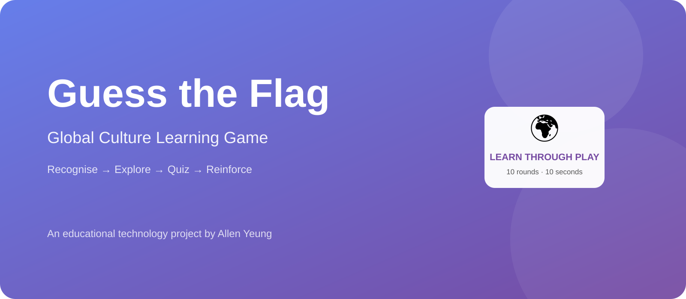
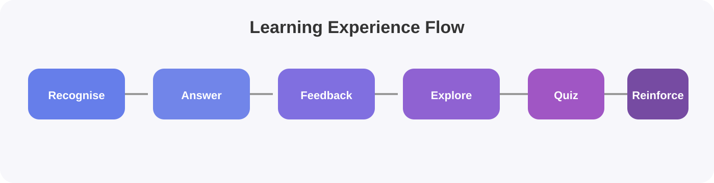
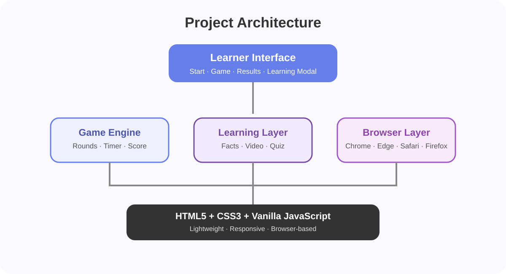

# 🌍 Guess the Flag — Global Culture Learning Game

> **An interactive educational web experience that turns global geography and cultural literacy into a playful learning journey.**

## 🎯 Project Overview

**Guess the Flag** is an interactive educational game designed to strengthen students' global awareness and cultural literacy through short, engaging rounds of play.

Players identify country flags under time pressure, earn points, explore country information, watch related educational videos, and reinforce their learning through quizzes. The current implementation includes a 10-round game, a 10-second timer per challenge, scoring, progress feedback, country-learning content, embedded video, and follow-up quizzes.

This project was originally developed as a Digital Technologies Innovation assignment and has been intentionally presented here as a standalone educational technology project rather than simply an academic submission.

## 🌟 Why This Project Exists

Many learners can recognise a flag without understanding the country behind it. **Guess the Flag** uses the moment of recognition as the starting point for deeper cultural discovery.

The design question is simple:

> **How can a short game turn “I know this flag” into “I want to know more about this country”?**

## 🧠 Learning Experience

The experience follows:

**Recognise → Answer → Receive Feedback → Explore → Quiz → Reinforce**

Instead of treating the quiz as the final destination, the game uses it as an entry point into broader learning.

## ✨ Core Experience

### 🏁 Learn Through Play
- 10-second challenge per flag
- 10 rounds per game
- 100 points for each correct answer
- Real-time score and progress tracking
- Visual feedback for correct and incorrect answers

### 🌎 Explore Beyond the Flag
After gameplay, learners can continue learning through:
- Country facts
- Embedded educational video content
- Follow-up quizzes
- Immediate feedback and reinforcement

### 📚 Designed for Education
The project is built around a simple principle:

> **Turn recognition into curiosity, and curiosity into learning.**

## 🏗️ Project Architecture

The application is deliberately lightweight and browser-based. The repository contains the HTML game implementation, with styling and interaction logic embedded in the web application. It is designed for modern browsers including Chrome, Safari, Firefox, and Microsoft Edge.

## 🖥️ Main Experience

### Start Screen
Introduces the learning objective and game rules before the learner begins.

### Game Screen
Displays:
- Current flag
- Multiple-choice answers
- Score
- Round number
- Countdown timer
- Progress indicator

### Learning & Quiz Experience
The country information layer extends the experience beyond the answer itself, using video and quiz interaction to support further exploration.

### Results
The final score provides a clear sense of achievement and encourages replay and continued practice.

## 💻 Technology

- **HTML5**
- **CSS3**
- **Vanilla JavaScript**
- Responsive web design
- Embedded video content
- Interactive quiz logic
- Browser-based game state and scoring

## 🎥 Project Demo

### Watch the demonstration

**[▶ Open the GitHub Pages Demo Player](https://allenyeung365.github.io/ASSIGNMENT-4-Digital-Technologies-Innovation/demo.html)**

The GitHub Pages demo page embeds the project video hosted on Google Drive and provides direct links to the live application, source code, and original video file.

**Direct video:** [Open the 2:33 project demonstration on Google Drive](https://drive.google.com/file/d/1BzGPbT1nUrdb4L8-MhsHGcglKYfKjred/view?usp=sharing)

> **Note:** The video file itself remains hosted on Google Drive. The GitHub repository now provides a dedicated GitHub Pages presentation page for the video, avoiding the need to store a large binary video file directly in the Git repository.

## 🚀 Live Demo

**Try the project:** https://allenyeung365.github.io/ASSIGNMENT-4-Digital-Technologies-Innovation/

## 📸 Project Materials

The repository includes a project hero banner, learning-flow diagram, and architecture diagram so that the work can be understood as a complete portfolio project rather than only a code submission.

## 🌱 Educational Value

**Guess the Flag** is more than a geography quiz. It is a reusable pattern for educational experiences where short interactions lead to deeper exploration.

Potential applications include:

- English language learning
- Geography education
- Cross-cultural awareness
- International orientation programmes
- Classroom warm-up activities
- Self-directed learning
- EdTech gamification experiments

## 🚀 Future Development

Potential next-stage improvements include:

1. Adaptive difficulty based on learner performance
2. Personalised question selection
3. Progress dashboards and learning analytics
4. User accounts and achievement systems
5. Expanded cultural content and multilingual support
6. AI-generated explanations and personalised feedback
7. Cloud-backed content and analytics

## 👤 Creator

**Allen Yeung**

Education professional · Digital Technology enthusiast · AI & Cloud learner

Allen is interested in building technology-enhanced learning experiences that connect education, interactive media, and emerging AI technologies.

## 🔗 Project Links

- **Live Demo:** https://allenyeung365.github.io/ASSIGNMENT-4-Digital-Technologies-Innovation/
- **Project Demo Player:** https://allenyeung365.github.io/ASSIGNMENT-4-Digital-Technologies-Innovation/demo.html
- **GitHub Repository:** https://github.com/ALLENYEUNG365/ASSIGNMENT-4-Digital-Technologies-Innovation
- **Demo Video:** https://drive.google.com/file/d/1BzGPbT1nUrdb4L8-MhsHGcglKYfKjred/view?usp=sharing

---

### From assignment to portfolio project

This repository began as **Assignment 4 – Digital Technologies Innovation**. It is now documented as an independent educational technology project so that the idea, learning design, implementation, visuals, demo, and future development direction are visible beyond the original academic context.
